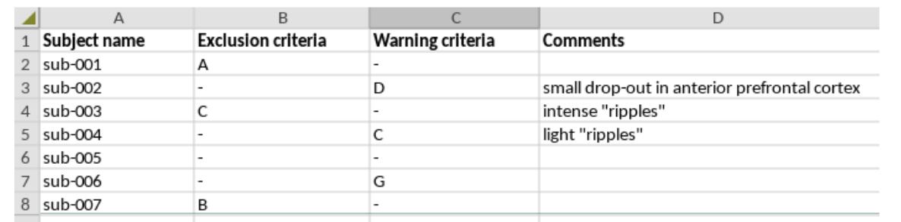
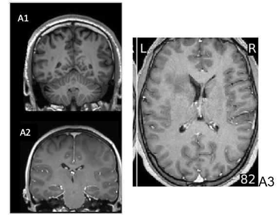
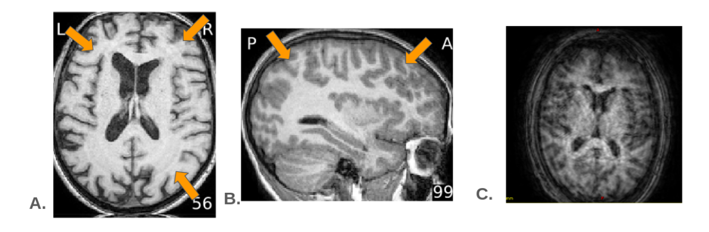

# Quality Control guide

WORK IN PROGRESS

## Introduction

The purpose of this section is to provide advice on how to perform quality control (QC) on raw MRI data for clinical research studies,specifically focusing on anatomical and functional MRI data.
The idea is to suggest a visual QC approach, ideally using existing software that generates quality reports and metrics (e.g., MRIQC software).

There are various methods for conducting quality control on raw data and this section is juste one of them. The most crucial aspect is to closely examine the data to better understand it and accurately interpret the analyses.

## General advices 

- During the acquisition of an MRI sequence, various issues may arise and may affect image quality. These can include artifacts related to the MRI scanner, image reconstruction issues (e.g., folding), or choices made during acquisition (e.g., incorrect field of view). 
Additionally, there may be physiological artifacts related to the patient (e.g., movements). Performing quality control on the data helps identify data that should be excluded because they could interfere with the analyses. The goal is to determine whether the image can be used to answer the study's questions.

- Ideally, an initial data check should be performed during acquisition to potentially redo any problematic sequences (if possible). For example, if a subject moved significantly during one of the main protocol sequences, it might be more useful to redo that sequence rather than completing the optional sequences (if there are any).

- A "good data" from a quality control perspective does not necessarily mean that the chosen sequence is suitable for the intended application. The selected parameters may be inadequate for the planned analyses (e.g., significant signal loss in the area of interest due to the chosen parameters). Therefore, it is important to discuss with an MRI physicist before starting acquisitions to properly set up the sequences and conduct pilot subjects. If a particular area is crucial for data analysis (e.g., if fMRI activation is expected in this area or, for anatomicatl data, if this area should be segmentated), it is useful to add an exclusion criterion for data based on the quality of that specific area.

- Currently, there is no consensus on how to perform QC; there is no single "correct way" to conduct QC (different tools, methodologies, and sometimes different definitions for quantitative values). Some rejection criteria for an image may depend on the study and the analyses to be performed. To maintain consistency in quality control, it is important to follow the same QC steps within the same study.

- It is sometimes useful to use pre-processing to perform QC on raw data because it helps to better understand the data. For example, for an anatomical sequence, it might be useful to check if the segmentation of white/gray matter is done correctly. For a diffusion sequence, it might be useful to look at reconstructions maps like FA.

- This section focuses on image quality, but for functional MRI data, it is also useful to have a method for verifying if the subject performed the task correctly/if the measurements were properly recorded.

- It is important to document the QC steps and results in an understandable manner to share the QC results along with the data (in an Excel file, for example).

## Verification of the data "integrity" and of the parameters

The first step is to verify the "integrity" of the data, meaning ensuring that the data is ready for analysis. Here is a non-exhaustive list of things that are useful to check:

- Verification of the database consistency in terms of subject identifiers and session dates.

- Verification of the sequences received per subject (do all subjects have all the sequences of the protocol? The mandatory sequences? Are any sequences duplicated?). It is useful to document this information (in an Excel table, for example).

- Checking that the DICOM files are complete. In "classic" mode, a DICOM file is generated for each acquired image (slice, dynamic, echo, etc.) and so there are several DICOM files for one sequence. In "Enhanced" mode, a single file is generated for each sequence (with a certain size limit). In classic mode, it is possible that an export or transfer error results in missing some DICOM files, and thus some images. It may be useful to check the size of the images converted to NIfTI to highlight such problems. This check can also be done during the visual inspection of the images.

- Verification of the main acquisition parameters. Some parameter modification may have been made during the coyrse of the study and may influence the analyses (eg, modification of repetion time following an upgrade of the MRI software). Here is a non-exhaustive list of the parameters that may be useful to check: echo time, repetition time, voxel size, number of repetitions for functional MRI, parallel imaging... Depending on the sequence, certain parameters are more important to check than others.

## QC of anatomical and functional data with MRIQC

In this section, we propose to use MRIQC to perform QC of anatomical and functional data. 
The idea is to use the visul report to perform a data QC. However, it is useful to open the image in a specific viewer in case of doubt about image quality, or to see the different dynamics of a functional sequence.

To use MRIQC check out the documentation [here](mriqc.md) or directly the [MRIQC documentation](https://mriqc.readthedocs.io/).

Once the MRIQC's results are available,for each subject, open the MRIQC report (explanation can be found [here](https://mriqc.readthedocs.io/en/latest/reports.html#demo-anatomical-reports)).

The report contains several mosaics (mean signal, zoomed-in on the brain, image with background noise enhancement...). For functional data, there's also a summary graph, including a plot for framewise displacement (FD) and a carpetplot. The FD represents the displacement of the subject's head. Each line of the carpetplot represents the value of a voxel over time (separated by region). 

Check each mosaic and graph and check whether any of the criteria proposed and detailed below are present and whether this should lead to the exclusion of the data for analysis.

Very often, certain artifacts are present on the image but do not imply that the image should be excluded. In such cases, it may be useful to report the presence of the artifact anyway.

One solution is to report the information in an Excel spreadsheet, with a column for reporting excluding criteria and a column for non-excluding criteria (and comments, if needed): 

In case of doubt or if the visual report is not precise enough, open the image in a specific viewer and review the different slices / dynamics.

# Proposed Quality Control Steps for structural T1w MRI

In this section, we consider a non-contrast T1 anatomical sequence.

We propose a list of criteria that may lead to the exclusion of an anatomical image. This list may need to be adjusted according to the study criteria and the planned analyses. If a specific area is critical for the study (e.g., the hippocampus if the study aims to segment the hippocampus), it may be useful to add a QC criterion for this area ("is there an artifact in this area?").

Some criteria are based on the images available in the MRIQC report (alignment in MNI, segmentation, etc.). Other criteria can be used by simply viewing the image in a viewer.

**Proposed Quality Control criterion**:

|    | Descriptions
 -- | -- 
A |Gadolinium-injected sequence
B |Incomplete brain coverage or abnormal subject positioning (subject rotation)
C |Significant movement artifacts (“wrinkles” or “blur” or cortex duplication) or in a critical area for the study
D |Significant signal loss (susceptibility artifact) or in a critical area for the study
E |Eye artifacts encroaching on the brain
F |Significant non-uniformity of intensity (bias inhomogeneity)
G |Background noise or folding ghost artifact with an impact on the brain
H |Very low gray/white matter contrast
I |Inconsistent segmentations
J |Poor alignment in MNI
K |Unexpected anatomical anomalies/pathologies not accounted for by the protocol
L |Others

How to check each criteria is detailed below with examples. 

#### A. Gadolinium-injected sequence
Look atthe first mosaic ("Zoomed-in mosaic view of the brain") in the report.

/!\ *When you're not an expert, it can be very difficult to see the difference between injected and non-injected sequences.*

**Figure** : * **A1**: T1W without gadolinium **A2**: Gadolinium-injected T1w (from https://doi.org/10.1016/j.media.2021.102219.) **A3**: Gadolinium-injected T1w*.

#### B. Incomplete brain coverage or abnormal subject positioning (subject rotation)
Look at the first mosaic in the report ("Zoomed-in mosaic view of the brain"), in particular the extreme sections (bottom and top of the brain) and the sagittal mosaic, which allows you to quickly see whether or not the brain is fully covered. 

/!\ *In the case of certain studies, total non-coverage of the brain may be deliberate, so check the acquisition protocol.* 

#### C.Significant movement artifacts (“wrinkles” or “blur” or cortex duplication) or in a critical area for the study

Look at the first mosaic ("Zoomed-in mosaic view of the brain") in the report. 

Head movements during acquisition result in the appearance of lines that are rather concentric ("wrinkles" / "ripples") or a "blur" or duplication in the cortex in certain parts or throughout the image.
Depending on the planned analysis on the anatomical sequence, it may be acceptable to retain sequences with slight movements.

It is important to know the areas of interest in the study (or the subjects' pathology). For example, if the aim of the study is to segment the hippocampus, movement artifacts in the hippocampus will require the image to be excluded, whereas movement artifacts in the cerebellum will not.

**Figure** : * **A and B**: Wrinkles, the image is not necessarily to be excluded, it depends on the analyses planned **C**:Movement is very important (wrinkles + blur), to be excluded if segmentation analyses are to be carried out.*.

