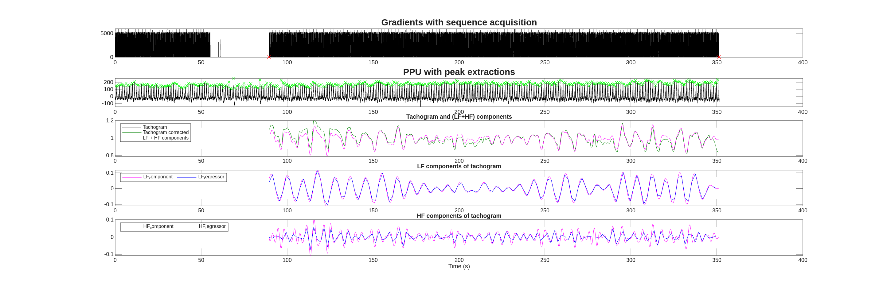

#  Heart Rate Variability (HRV) and fMRI

## Quick introduction to HRV

Heart rate variability (HRV) refers to the continuous fluctuations in the duration between successive R-R intervals (i.e, the intervals between two consecutive ventricular depolarizations) over a given period.
Spectral analysis of HRV is a non-invasive technique enabling a quantitative assessment of the
sympathovagal balance. An increase in the R-R interval is associated with the sympathetic system (acceleration of heart rate) while a decrease reflects parasympathetic system. 

Key information:

- In healthy individuals, the correlation between heart rate (measured as the R-R intervals) and beat-to-beat plethysmographic signal is higher than 0.99 with a mean delay of 620 ms (Rubio et al, 2015).

- HRV can be analyzed using three approaches: time-domain, frequency-domain, and non-linear methods (the latter being less commonly used).

- Temporal analysis: 
    - The tachogram is the curve representing the values of the R-R intervals as a function of time.
    - Some frequently-used variables:
        - SDNN (Standard Deviation of Normal-to-Normal interbeat intervals)
        - RMSSD (squared Root of the Mean of the Sum of the Squares of Differences between successive NN intervals). 

- Frequency analysis: HRV spectrum can be divided into three main components: 
    - from 0.15 to 0.4 Hz: high frequency (HF) power spectrum that reflects parasympathetic tone and fluctuations caused by respiratory sinus arrhythmia; 
    - from 0.04 to 0.15 Hz: the low frequency (LF) power spectrum that reflects both sympathetic and parasympathetic tone due to the influence of the baroreflex regulation
    - from 0.0033 to 0.04 Hz: the very low frequency (VLF) power spectrum attributed to thermoregulatory processes, peripheral vasomotor activity and the renin-angiotensin system

## HRV and fMRI

Given the established connections between brain activity and cardiac function, it may be of interest to add HRV data as regressor for functional MRI analysis (the HRV signal must be resampled to match the fMRI temporal resolution (TR)).

However, a few precautions are necessary. The frequency range of the fMRI data (from –1/(2×TR) to +1/(2×TR)) limits the usable HRV components. Regressors containing frequencies beyond this band cannot be reliably modeled.

For example: 

- With a TR of 2.5 s, the fMRI frequency range is approximately ± 0.2 Hz. Therefore:

    - The HF band (0.15–0.4 Hz) partially exceeds this range → cannot be used as a regressor.

    - The LF band (0.04–0.15 Hz) falls within range → can be used.

- With a TR of 3 s, the range is approximately ± 0.167 Hz:

    - The HF band exceeds the upper frequency limit → not usable.

    - The LF band is close to the upper boundary → risk of aliasing. Its use is not recommended under these conditions.

## Quick bibliography

- Matusik, P. S.; Zhong, C.; Matusik, P. T.; Alomar, O.; Stein, P. K. Neuroimaging Studies of the Neural Correlates of Heart Rate Variability: A Systematic Review. J Clin Med 2023, 12 (3), 1016. https://doi.org/10.3390/jcm12031016.

- Chang, C.; Metzger, C. D.; Glover, G. H.; Duyn, J. H.; Heinze, H.-J.; Walter, M. Association between Heart Rate Variability and Fluctuations in Resting-State Functional Connectivity. Neuroimage 2013, 68, 93–104. https://doi.org/10.1016/j.neuroimage.2012.11.038.

- Task Force of the European Society of Cardiology and the North American Society of Pacing and Electrophysiology, 1996. Heart rate variability: standards of measurement, physiological interpretation and clinical use. Circulation 5, 1043-1065.

- Pelliser, S. Electrophysiologie de la cognition Chapitre 7. Variabilité du rythme cardiaque, 157-177

## Philips system - ScanPhysLog file

At IRMaGe, it is possible to record physiological data during MRI acquisition using the photoplethysmographic unit (PPU) of the Philips Achieva MRI scanner. The PPU measures the hemodynamic pulse at the fingertip.

For each sequence, a ScanPhysLog file is generated, containing both the PPU signal (sampled at 500 Hz) and the MR gradient triggers.

A home-made Matlab code is available on the [IRMaGE-3T github repository](https://github.com/IRMaGe-3T/irmage-tools/blob/main/physiological_data/HRV_philips_scanphyslog/ppu4fmri.m) to load and read the ScanPhysLog files containing ppu data, calculate the tachogram, extract and resample the low frequency (LF)-HRV to used it as regressors in fMRI (task or rs) analysis.

The main steps of the script are the following:

- Select the log file and enterinput acquisition parameters 
- Load the data (may take time for large files).
- Use MR gradient signals to identify the start and end of the fMRI acquisition.
- Detecte the peaks of the PPU signal and correcte for missing peaks or supernumerary peaks. 
- Compute peak-to-peak intervals to generate the tachogram
- Resample the tachogram at TR to obtain the HR(t) signal as a function of time. 
- Use frequency analysis to obtain the HRV features (the total power of the tachogram, the power of the LF and of the HF components, the LFn, the HFn and the Lfn/Hfn ratio)
- Generate LF-HRV regressors (resampled at TR) for use in fMRI analysis.

The program provides 4 files:
- SCANPHYSLOGxxx_QC.png: Quality control plots (PPU peaks, tachogram, HR and LF components).
- SCANPHYSLOGxxx_frequency_spectrum.png: HRV frequency spectrum.
- SCANPHYSLOGxxx_results.tsv: tachogram analysis results (heart rate, RMSSD, SDNN, total power ..)
- SCANPHYSLOGxxx_reg_LF_HRV.tsv: LF-HRV regressors for fMRI 

Example of quality control plots:

