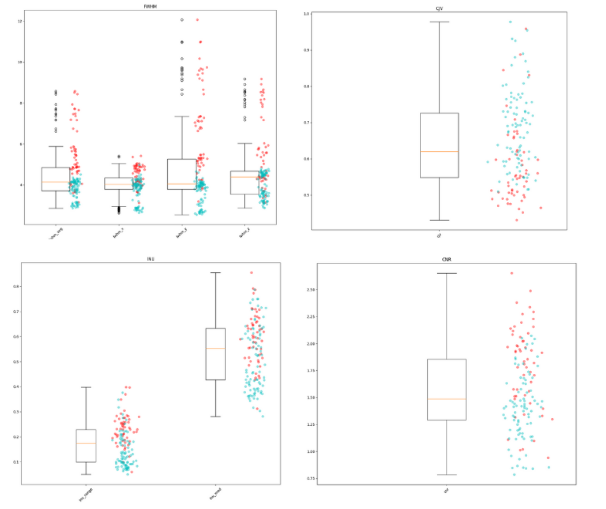

# MRIQC

## Introduction

[MRIQC](https://mriqc.readthedocs.io/) is a BIDS-App for quality control of functional fMRI and structural (T1w and T2w) data. MRIQC extracts no-reference IQMs (image quality metrics).

The aim of MRIQC is to extract image quality metrics (metrics without reference, i.e. that cannot be compared to a reference value for measurement since there is no ground truth about what that number should be). A visual report with mosaic views of a number of cutting planes and additional information is also obtained.

MRIQC works only with input data in [BIDS](BIDS.md) format.

The [workflows](https://mriqc.readthedocs.io/en/latest/workflows.html) are described in MRIQC documentation and the code is on [github](https://github.com/nipreps/mriqc).

There are some workflows's differences between the different versions, so the IQMs of the same image can vary if you are using different version.
Always use the same version to process a cohort. 

## Installation and usage
### Usage

MRIQC can be run on specific subjects using --participant-label or --session-id options.

There are also some specific options for functional MRI workflow configuration.

Find all options in [MRIQC documentation](https://mriqc.readthedocs.io/en/latest/running.html) or using -h option.

### MRIQC with docker

It is the quickest way to run MRIQC if you already have Docker installed. 
The docker image can be found [here](https://hub.docker.com/r/nipreps/mriqc/tags) (old docker version can be found [here](https://hub.docker.com/r/poldracklab/mriqc/tags)).

Pull the latest version of the MRIQC container from Docker Hub:

```
docker pull nipreps/mriqc:latest
```

Notes: depending on how docker is installed on your computer you may need administrator rights to pull and use the imgage

Check the MRIQC version:

```
docker run -it nipreps/mriqc:latest --version
```

Run: 
```
docker run -it --rm --user 2001:2001 -v /path_to_bids_folder:/data -v /path_to_bids_folder/derivatives/mriqc:/out -v /path_to_tmp_folder/work_tpm:/work nipreps/mriqc:23.1.0 /data /out participant  -w /work --no-sub --verbose-reports

```
The "--verbose-reports" option provides full reports. 

### "Bare-metal" installation

It should be used only for specific reasons (specific tests, issue with docker, get intermediate images computed by MRIQC..). It required to install several dependencies as FSL, AFNI, ANTs and freesurfer and some specifics libraries versions are needed. So you may have software/ package versions issues depending on what libraries are installed on your computer.

Installation of MRIQC using pip : 
```
pip3 install --user mriqc
```

Possible issues with the 22.06 version: 

- package networkX's version should be <= 2.5
pip3 install --user networkx==2.5

- package numpy's version should be <= 1.23.0
pip3 install --user networkx==1.23.0

- ANTs's version should be the same as the one used in the Docker image. 
This version can be found here : https://dl.dropbox.com/s/gwf51ykkk5bifyj/ants-Linux-centos6_x86_64-v2.3.4.tar.gz

Run: 
``` 
mriqc bids-root/ output-folder/ participant
```

### MRIQC in MIA (populse mia)
If you are using MIA software it is possible to run MRIQC pipeline in MIA. 
It required to install MIA software and several dependencies as FSL, AFNI, ANTs and freesurfer. 

Launch MIA and configure libraries (AFNI, ANTS, Freesurfer and FSL) in preferences. 

Run the `Anat_mriqc` or` Bold_mriqc` pipelines on your file.

## Image Quality Metrics (IQMs)

Some no-reference IQMs are extracted in the final stage of all processing workflows run by MRIQC.
See here https://mriqc.readthedocs.io/en/latest/measures.html for explanations about each IQMs. 

As it is no-reference IQMs they cannot be compared to a reference value for the metric since there is no ground-truth about what this number should be.

These metrics are available at the end of each report in the "Reproducibility and provenance information/Extracted Image quality metrics (IQMs)" section. 

It is quite difficult to interpret most of the metrics obtained for a single subject. It is, however, useful to compare them for subjects in the same study/group. 
A group report can be obtained with the following command:

```
docker run -it --rm --user 2001:2001 -v /path_to_bids_folder:/data -v /path_to_bids_folder/derivatives/mriqc:/out -v /path_to_tmp_folder/work_tpm:/work nipreps/mriqc:23.1.0 /data /out group 
```

A ".tsv" file with all the metrics for all the subjects and a visual report that makes it easier to compare the values are obtained. 

Outliers may indicate problematic data.
Note that, it's important to compare metrics for similar sequences from the same MRI machine! Some metrics are sensitive to changes in machine and parameters.

Example of the difference in metric values between a 1.5T and a 3T MRI machine (in blue 1.5T and in red 3T):  


Some of the metrics are also sensitive to clinical characteristics (e.g. pathology) or demographic characteristics (e.g. age).


The table below summarize the definitions of the IQMs in a more user-friendly definitions and an help to interpret them (table creating by the [mriqception team](https://github.com/elizabethbeard/mriqception/))


TYPE OF SCAN METRIC APPLIES TO | ABBREVIATION | NAME | DESCRIPTION
-- | -- | -- | --
Structural | cjv | Coefficient of joint variation | Coefficient of joint variation between white matter and gray matter.Higher values indicate more head motion and/or intensity non-uniformity artifacts.
Structural | cnr | Contrast-to-noise ratio | Contrast-to-noise ratio, reflecting separation between GM & WM.Higher values indicate higher quality.
Structural | snr_dietrich | Dietrich’s SNR | Dietrich et al. (2007)’s signal-to-noise ratio.Higher values indicate higher quality.
Structural | art_qi2 | Mortamet’s quality index 2 | A quality index accounting for effects of both clustered and subtle artifacts in the air background.Higher values indicate lower quality.
Structural | art_qi1 | Mortamet’s quality index 1 | The proportion of voxels outside the brain with artifacts to the total number of voxels outside the brain.Higher values indicate lower quality
Structural | wm2max | White matter-to-maximum intensity ratio | Captures skewed distributions within the WM mask, caused by fat and vascular-related hyperintensities.Ideal values fall within the interval [0.6, 0.8]
Structural | fwhm_ | Full-width half-maximum smoothness | Image blurriness (full-width half-maximum).Higher values indicate a blurrier image.
Structural | volume_fraction | Volume fraction | Summary statistics for the intra-cranial volume fractions of CSF, GM, and WM.Be aware of potential outliers.
Structural | rpve | Residual partial voluming error | Residual partial volume error.Higher values indicate lower quality.
Structural | overlap_ | Overlap of tissue probabilities | How well the image tissue probability maps overlap with those from the MNI ICBM 2009 template.Higher values indicate better spatial normalization.
Structural, Functional | efc | Entropy-focus criterion | Shannon entropy criterion. Higher values indicate more ghosting and/or head motion blurring.
Structural, Functional | fber | Foreground-background energy ratio | The variance of voxels inside the brain divided by the variance of voxels outside the brain.Higher values indicate higher quality.
Structural, Functional | inu_ | Intensity non-uniformity | Intensity non-uniformity (bias field) summary statistics.Values closer to 1 indicate higher quality; further from zero indicate greater RF field inhomogeneity.
Structural, Functional | snr | Signal-to-noise ratio | Signal-to-noise ratio within the tissue mask.Higher values indicate higher quality.
Structural, Functional | summary_stats | Summary stats | Summary statistics for average intensities in CSF, GM, and WM.
Functional | dvars | Derivatives of variance | The average change in mean intensity between each pair of fMRI volumes in a series.Higher values indicate more dramatic changes (e.g., due to motion or spiking).
Functional | gcor | Global correlation | Average correlation of all pairs of voxel time series inside of the  brain. Illustrates differences between data due to motion/physiological  noise/imaging artifacts.Values closer to zero are better.
Functional | tsnr | Temporal signal-to-noise ratio | Temporal signal-to-noise ratio taking into account mean signal over time.Higher values indicate higher quality.
Functional | fd_mean | Framewise displacement - mean | A measure of subject head motion, which compares the motion between the current and previous volumes.Higher values indicate lower quality.
Functional | fd_num | Framewise displacement - number | Number of timepoints with framewise displacement >0.2mm.Higher values indicate lower quality.
Functional | fd_perc | Framewise displacement - percent | Percent of timepoints with framewise displacement >0.2mm.Higher values indicate lower quality.
Functional | gsr | Ghost-to-signal ratio | Ghost-to-signal ratio along the x or y encoding axes.Higher values indicate lower quality.
Functional | aor | AFNI’S outlier ratio | Mean fraction of outliers per fMRI volume, from AFNI’s 3dToutcount.Higher values indicate lower quality.
Functional | aqi | AFNI’s quality index | Mean quality index, from AFNI’s 3dTqual.Values close to 0 indicate higher quality.
Functional | dummy | Dummy scans | Number of volumes in the beginning of the fMRI timeseries identified as non-steady state.


